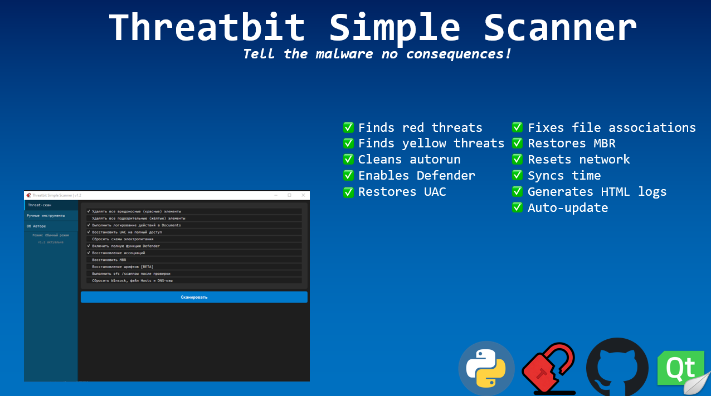
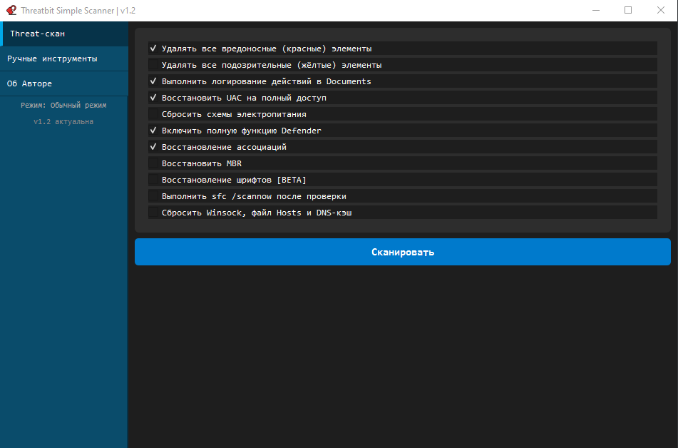
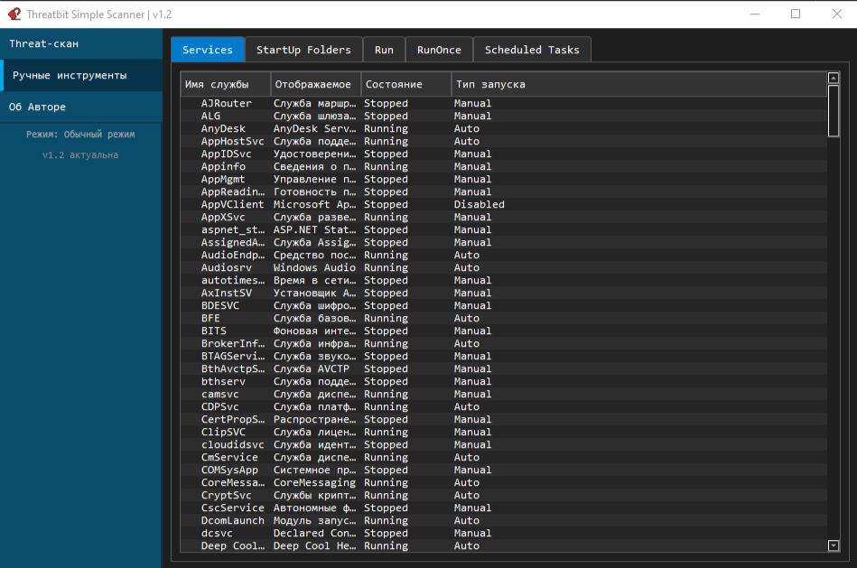
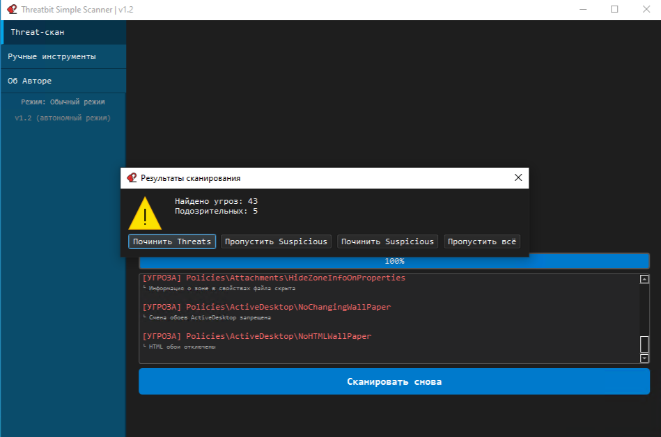

<div align="center">
  
<p align="center">
  
</p>

<br>
<h1>🛡 Threatbit Simple Scanner</h1>
<h4>Бесплатная утилита для сканирования и восстановления системы после вирусных атак с открытым исходным кодом. Находит и удаляет вредоносные изменения в реестре Windows (записи, которые могут мешать работе компьютера), которые пропускают обычные антивирусы.</h4>


<p align="center">
  
</p>

</div>

<br>


---
>[!WARNING]
>## ‼ Перед запуском программы ознакомьтесь с [EULA.md](https://github.com/2M12/ThreatbitSimpleScanner/blob/main/EULA.md)

> [!CAUTION]
> 
> ### ❗ О ложных копиях
> Официальные источники только [Github](https://github.com/2M12), [Дзен](https://dzen.ru/threatbit) и [Youtube](https://www.youtube.com/@ThreatBit_official). Телеграм-каналы/группы и в других источниках я ничего не выкладываю (они не являются официальными). Если вы наткнулись на что-то вне этого репозитория - это ложные копии, которые часто содержат вредоносное ПО.

> [!IMPORTANT]
>
> ### ⛔ Дисклеймер
> Программа работает с реестром Windows. Хотя все изменения безопасны, рекомендуется **создать точку восстановления** перед первым использованием.

> [!WARNING]
>
> ### ⚠️ О ложных срабатываниях антивирусов
> Некоторые антивирусы (особенно песочницы с правилами Sigma) могут ложно детектировать `ThreatbitScanner.exe` как «потенциально опасный», ссылаясь на распаковку `vcruntime140.dll`. Это связано с тем, что программа собрана с помощью PyInstaller (`--onefile`), который упаковывает необходимые библиотеки вместе с исполняемым файлом. Например, такое встречалось в v1.0 и v1.1, когда были Pyinstaller сборки.
Также некоторые антивирусы могут детектировать Nuitka-сборку как подозрительную. ESET: Packed.Nuitka.AL — прямо указывает что это детект упаковщика, а не вируса. Microsoft: Wacatac.B!ml — автоматический ML-детект, снимается после ручной проверки. AI-детекты (Malware.AI и подобные) — нейросети ошибаются на редких упаковщиках. 
Мой релиз не является вредоносным, код остаётся открытым!

---

## 🔍 Что проверяет

| Категория | Что ищет |
|-----------|----------|
| **Автозапуск** | Shell, Userinit, AppInit_DLLs, BootExecute, KnownDLLs |
| **IFEO** | Перехват процессов через Debugger (taskmgr.exe, regedit.exe и др.) |
| **SilentProcessExit** | Скрытый мониторинг завершения процессов |
| **LSA Providers** | Перехват учётных данных через Authentication/Notification Packages |
| **Policies** | 50+ ограничений групповых политик (DisableTaskMgr, NoControlPanel и др.) |
| **SafeBoot** | Подмена оболочки безопасного режима |

И другое

## 🛠 Что восстанавливает

- ✅ UAC (контроль учётных записей)
- ✅ Windows Defender (включает и защищает от отключения)
- ✅ Ассоциации файлов (.exe, .txt, .bat, .png и др.)
- ✅ MBR (главная загрузочная запись)
- ✅ Сетевые параметры (Winsock, Hosts, DNS-кэш)
- ✅ Системные шрифты [BETA]
- ✅ Целостность системных файлов (sfc /scannow)

---

## 📥 Установка

### Способ 1: Готовый .exe

Скачай `ThreatbitScanner.exe` из [Releases](https://github.com/2M12/ThreatbitSimpleScanner/releases) и запусти.

### Способ 2: Из исходников

```bash
git clone https://github.com/2M12/ThreatbitSimpleScanner.git
cd ThreatbitSimpleScanner
pip install -r requirements.txt
python main.py
```
---

## 🖼️ Скриншоты

<p align="center">
  
  <br><em>Главное меню </em>
</p>

<p align="center">
  
  <br><em>Ручные инструменты</em>
</p>

<p align="center">
  
  <br><em>Пример угроз</em>
</p>

## Как использовать (важный порядок)

### 🔴 Шаг 1. Лечим опасные угрозы (красные)
1. Запустите ThreatbitScanner.exe от имени администратора

2. В разделе «Threat-скан» оставьте включённой галочку Удалять все вредоносные (красные) элементы

3. Нажмите «Сканировать»

4. Дождитесь завершения — найденные угрозы будут выделены красным

5. Нажмите «Починить Threats»

### 🟡 Шаг 2. Лечим подозрительные\косвенные угрозы (жёлтые)
1. Нажмите «Сканировать снова»

2. Отключите галочку Удалять все вредоносные (красные) элементы

3. Включите галочку Удалять все подозрительные (жёлтые) элементы

4. Нажмите «Сканировать»

5. Нажмите «Починить Suspicious»

6. Перезагрузите компьютер

## 📋 Вкладки
### Threat-скан: Основное сканирование и исправление угроз.

### Ручные инструменты: Управление службами, автозагрузкой, реестром, задачами.

### Об авторе: Общая информация об авторе с ссылками.

## 🔑 Ручные инструменты

### Services — запуск, остановка, удаление служб, просмотр свойств

### StartUp Folders — файлы в папках автозагрузки (общие и пользовательские)

### Run / RunOnce — записи в реестре автозапуска (HKLM и HKCU)

### Scheduled Tasks — включить, отключить, запустить, удалить задачи планировщика (не очень удобный)

## 🔵 Требования
### Права администратора
### Если скачивается .py скрипт - установка нужных библиотек

## ☑️ Hash-суммы
```bash
MD5	9c83e0a05979dd46bbe45e6a7634683d
SHA-256	1f7791fe4d434bb9aa61e87046c58c85483b8d6c40476eb7f5af4ab07fb697b6
```
## 📜 Лицензия
MIT © 2026 Mikhail (2M12) / ThreatBit
